## BlogApp

BlogApp was a set of Android/UWP apps and Chrome extensions that I created for free for blogs/news websites and YouTube channels between 2014 and 2015 (I was 17 years old at the time). I started the project to improve my Android, UWP, Chrome and PHP development skills and to get my work in front of more people.

The first versions were just a simple WebView, but the latest versions were fully native Android apps written in Java, making full use of Material Design, loading content through the WordPress and Blogger REST API and supporting push notifications.

The Chrome extension was a wrapper for the RSS feed and supported push notifications for new posts, at a time when it was uncommon for websites to offer push notifications.

The UWP apps makes use of all UWP styles, supporting Windows push notifications and live tiles.

I didn’t publish the source code earlier because I thought the project could be monetized, but I have never made a single penny from it 😂. So I decided to publish it in 2025, more than 10 years after the latest version was released.

Don’t mind the coding practices or standards used here, I was just starting to learn Java, C#, PHP and how to build apps on my own at the time.

### Screenshots

| App | Version | Release date | #1 | #2 | #3 |
|-|-|-|-|-|-|
| [DropandoIdeias](./Android/DropandoIdeias) | 3.7.1 | 24/08/2015 |  | 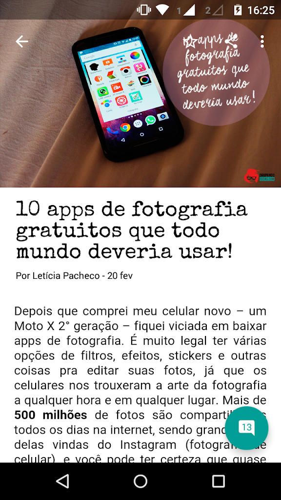 | 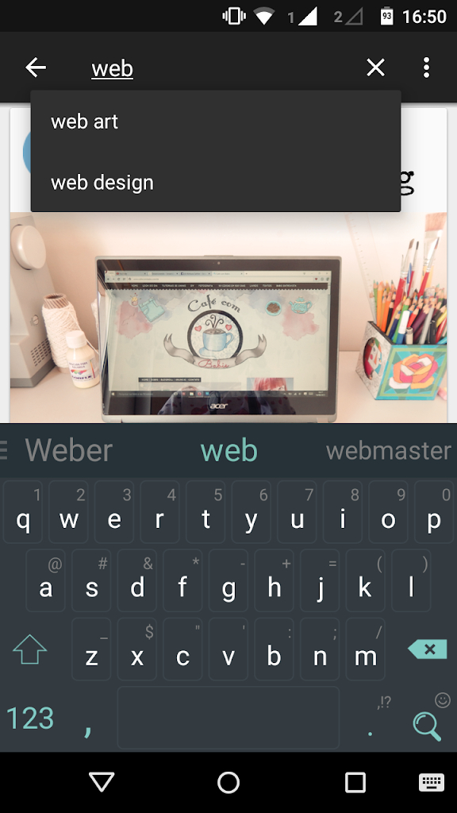 |
| [CasaDoCogumelo](./Android/CasaDoCogumelo) | 3.5.7 | 14/06/2015 | 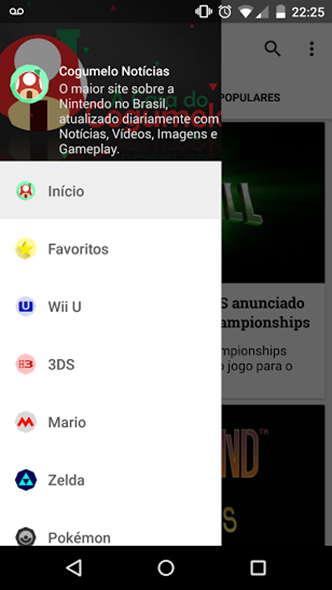 | 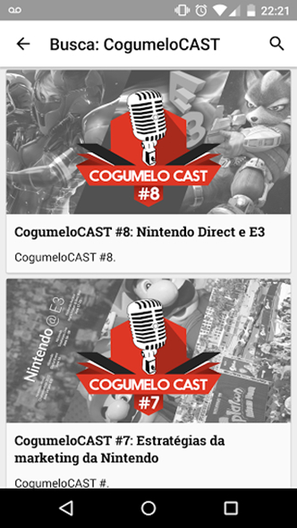 |  |
| [ZeldaComBr](./Android/ZeldaComBr) | 2.2.2 | 09/12/2014 |  |  |  |

More screenshots, including tablet version, on the directory for each app.

Screenshots of the evolution of the app inside [./Screenshots/Evolution](./Screenshots/Evolution/).

| [Chrome](./Chrome/) | [UWP](./UWP/) |
|-|-|
| 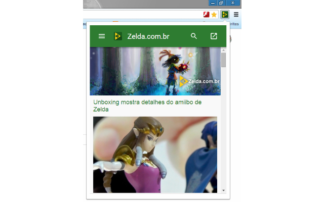 | 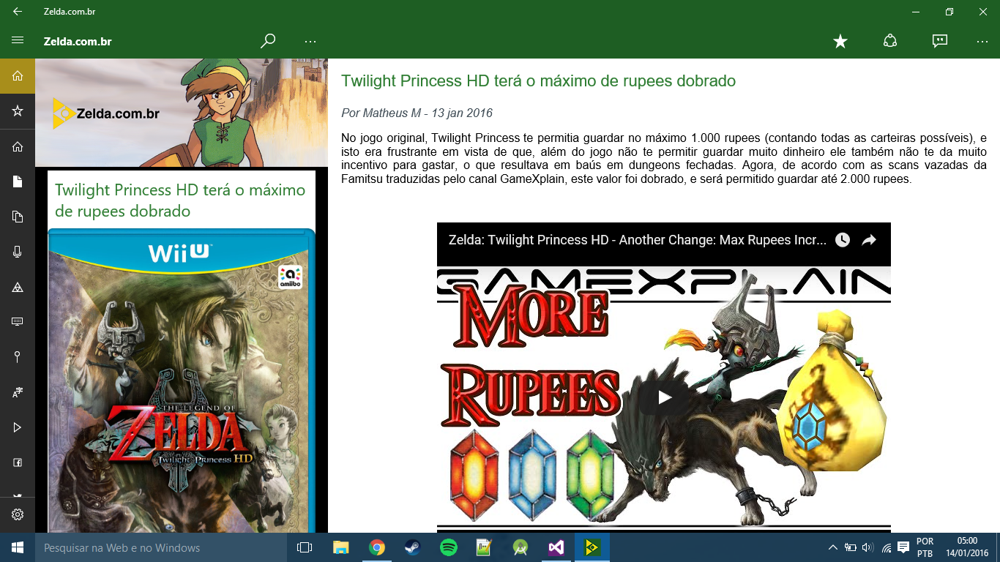 |
| 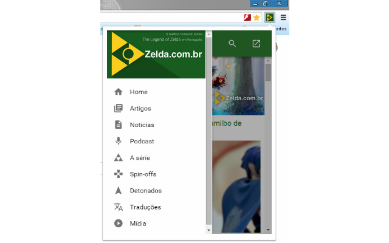 | 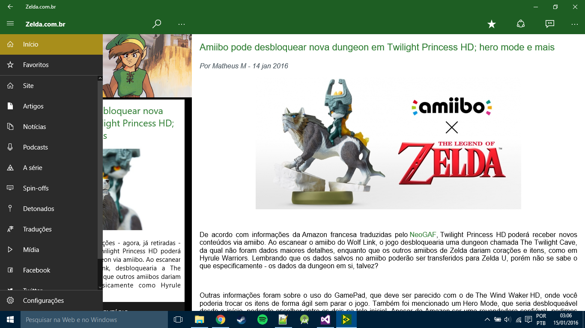 |
| 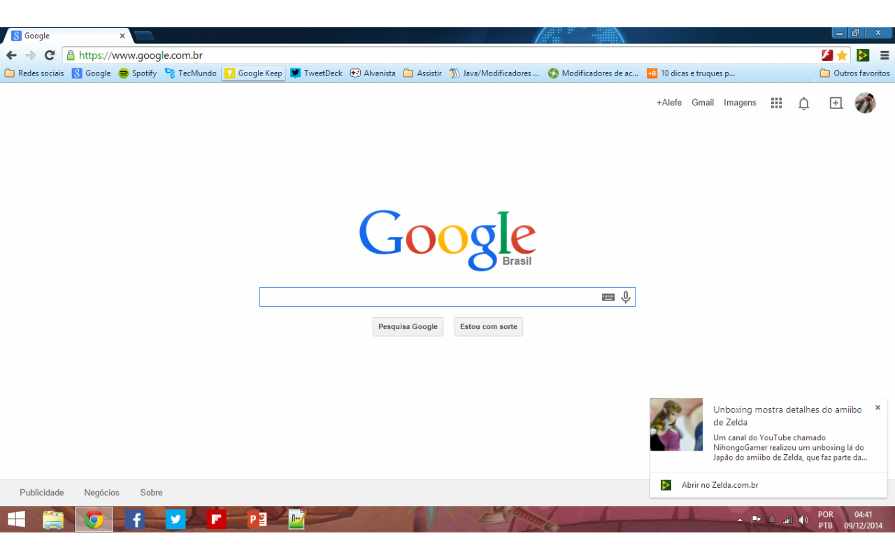 | 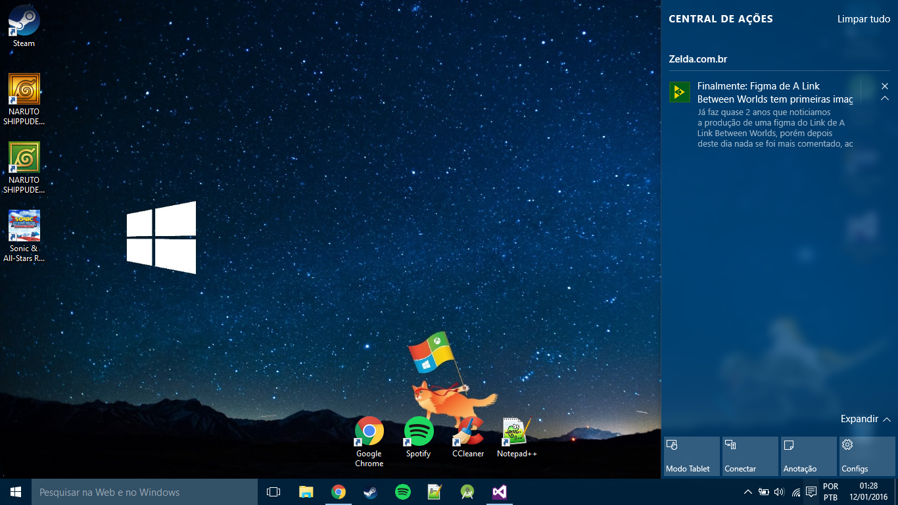 |
| 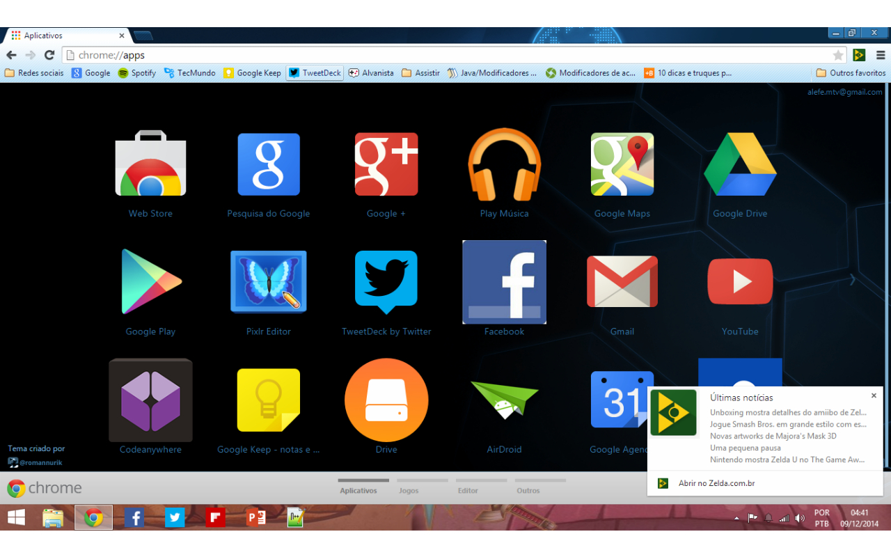 | 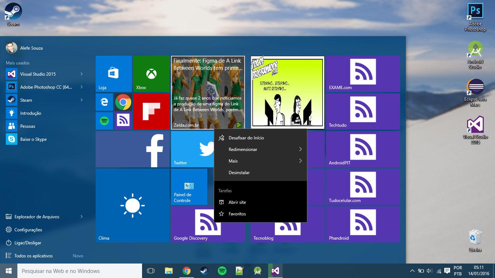 |

There's also a version for YouTube channels using the YouTube API, more information on [./YouTuber](./YouTuber/).

| Image 1 | Image 2 | Image 3 |
|-|-|-|
| 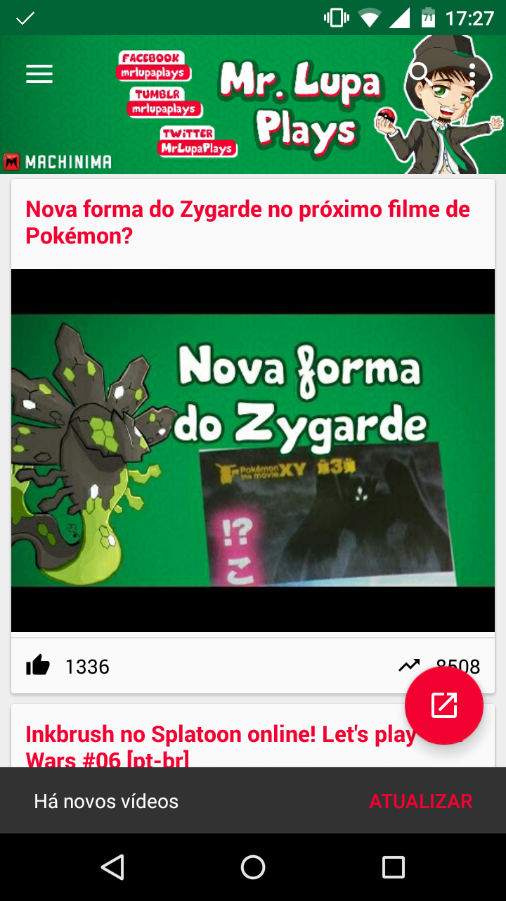 | 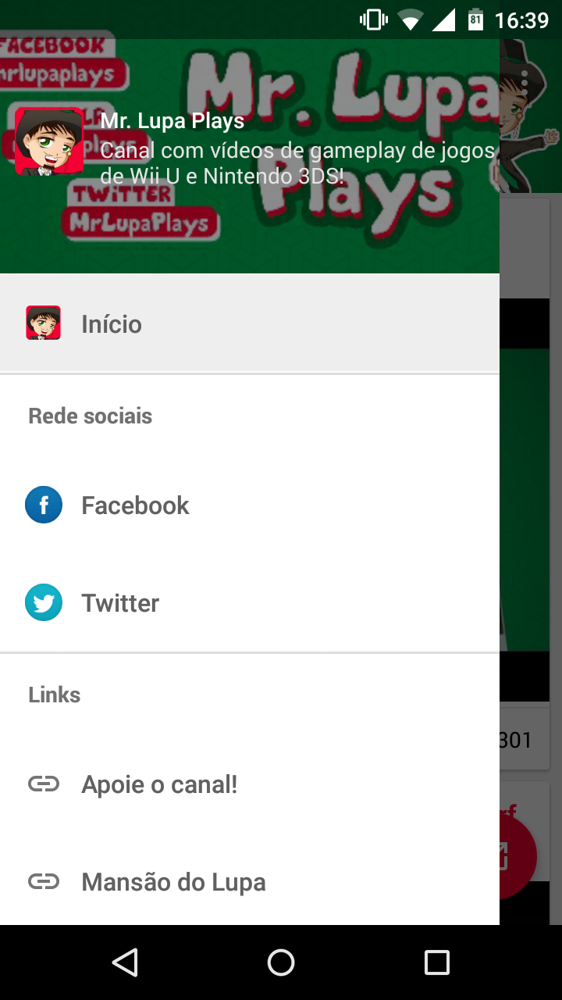 | 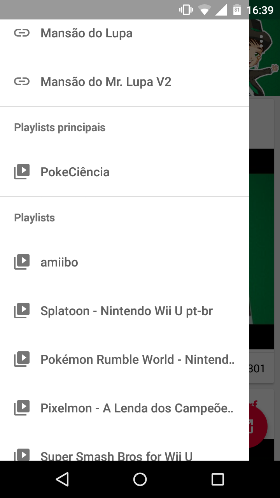 |
| 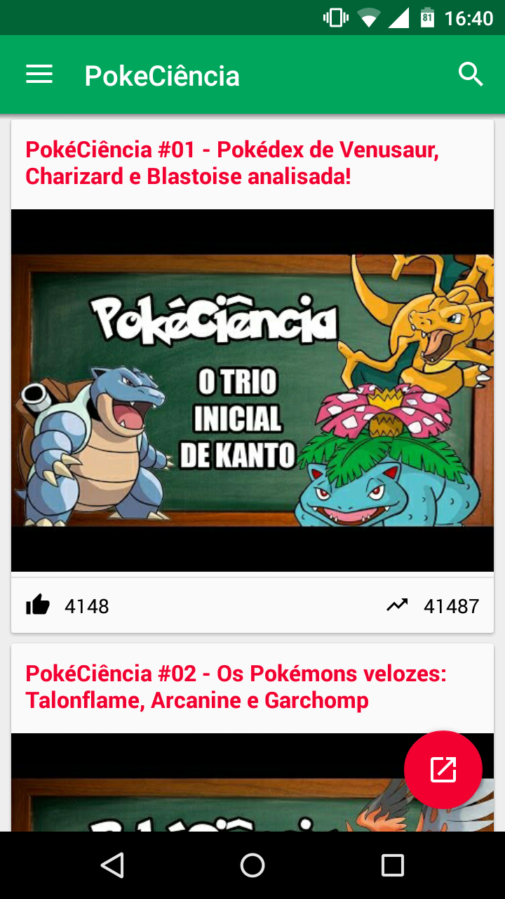 | 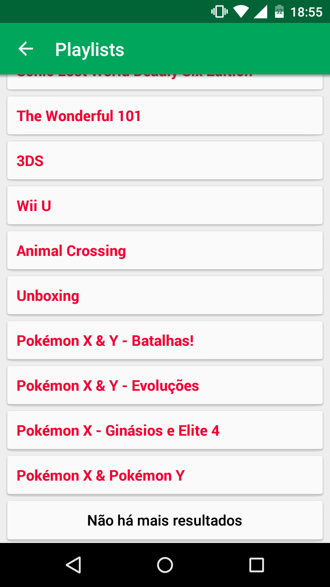 | 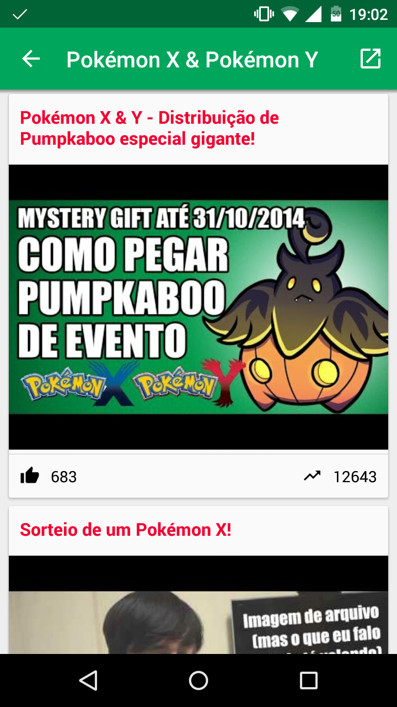 |

License
----------

    Copyright (C) 2015 Alefe Souza <contato@alefesouza.com>

    Licensed under the Apache License, Version 2.0 (the "License");
    you may not use this file except in compliance with the License.
    You may obtain a copy of the License at

        http://www.apache.org/licenses/LICENSE-2.0

    Unless required by applicable law or agreed to in writing, software
    distributed under the License is distributed on an "AS IS" BASIS,
    WITHOUT WARRANTIES OR CONDITIONS OF ANY KIND, either express or implied.
    See the License for the specific language governing permissions and
    limitations under the License.
