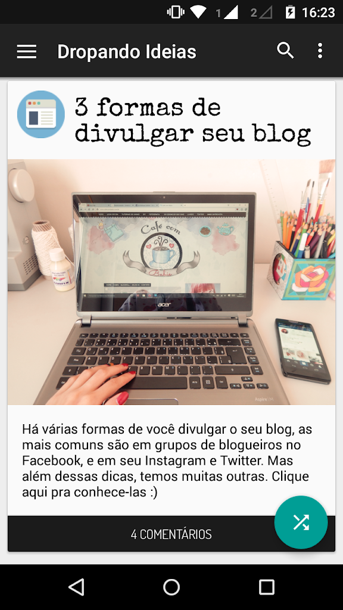
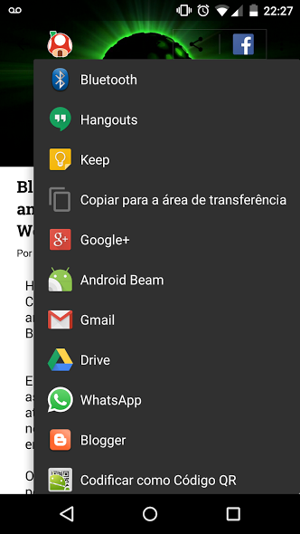

## BlogApp

BlogApp was a set of Android apps I created for free for blogs and news websites between 2014 and 2015 (I was 17 years old at the time). I started the project to improve my Android development skills and to get my work in front of more people.

The first versions were just a simple WebView, but the latest versions were fully native Android apps written in Java, loading content through the Blogger REST API.

I didn’t publish the source code earlier because I thought the project could be monetized, but I never made a single penny from it 😂. So I decided to publish it in 2025, more than 10 years after the latest version was released.

### Screenshots

| App | Version | #1 | #2 | #3 |
|-|-|-|-|-|
| DropandoIdeias | 3.7.1 |  |  |  |
| CasaDoCogumelo | 3.5.7 |  |  |  |
| ZeldaComBr | 2.2.2 |  |  |  |

More screenshots, including table version, on the directory for each app.

Licença
----------

    Copyright (C) 2015 Alefe Souza <contato@alefesouza.com>

    Licensed under the Apache License, Version 2.0 (the "License");
    you may not use this file except in compliance with the License.
    You may obtain a copy of the License at

        http://www.apache.org/licenses/LICENSE-2.0

    Unless required by applicable law or agreed to in writing, software
    distributed under the License is distributed on an "AS IS" BASIS,
    WITHOUT WARRANTIES OR CONDITIONS OF ANY KIND, either express or implied.
    See the License for the specific language governing permissions and
    limitations under the License.
