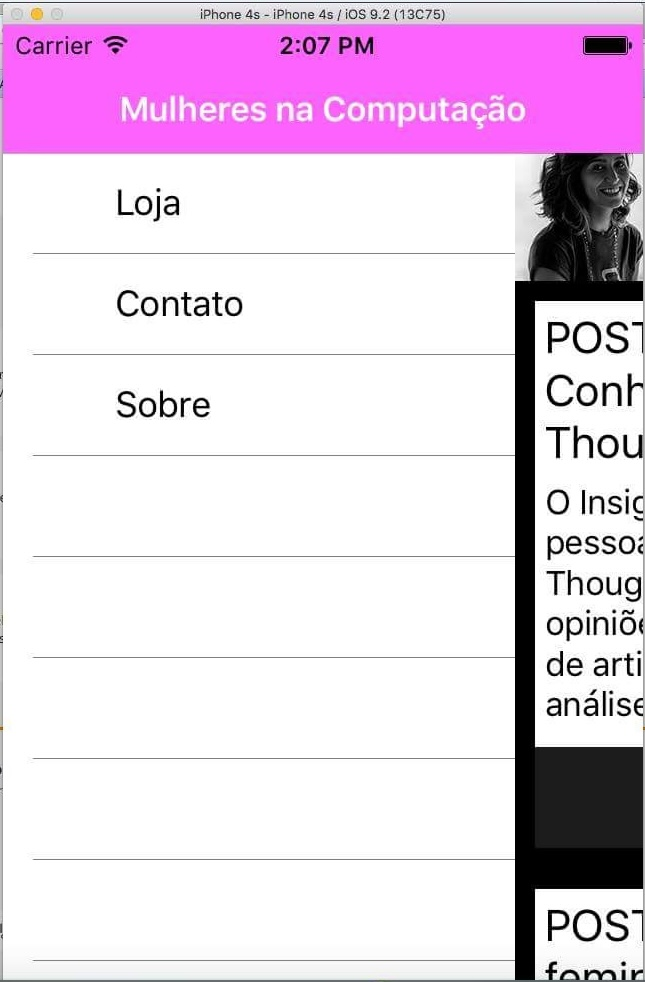
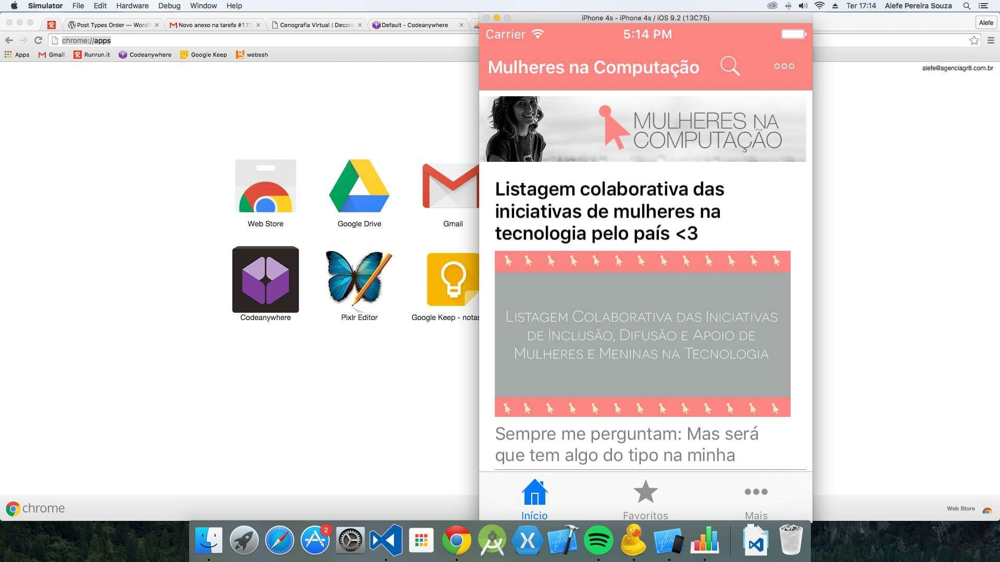
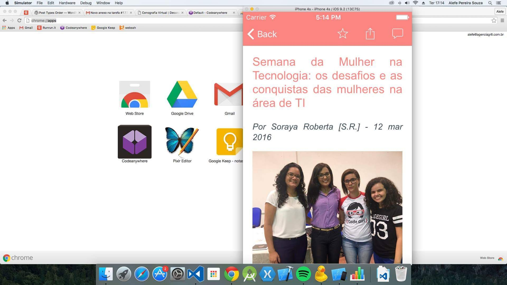
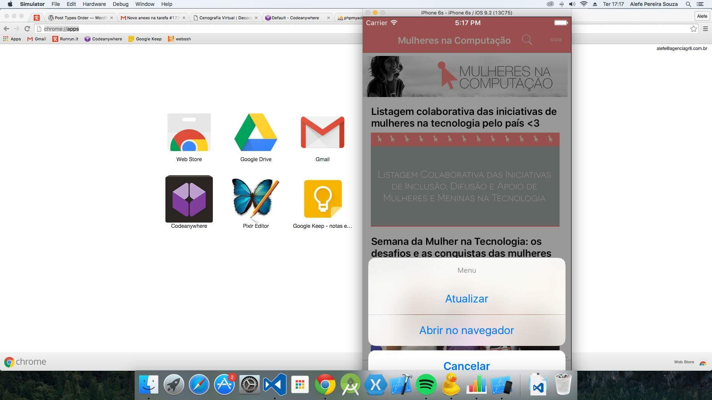
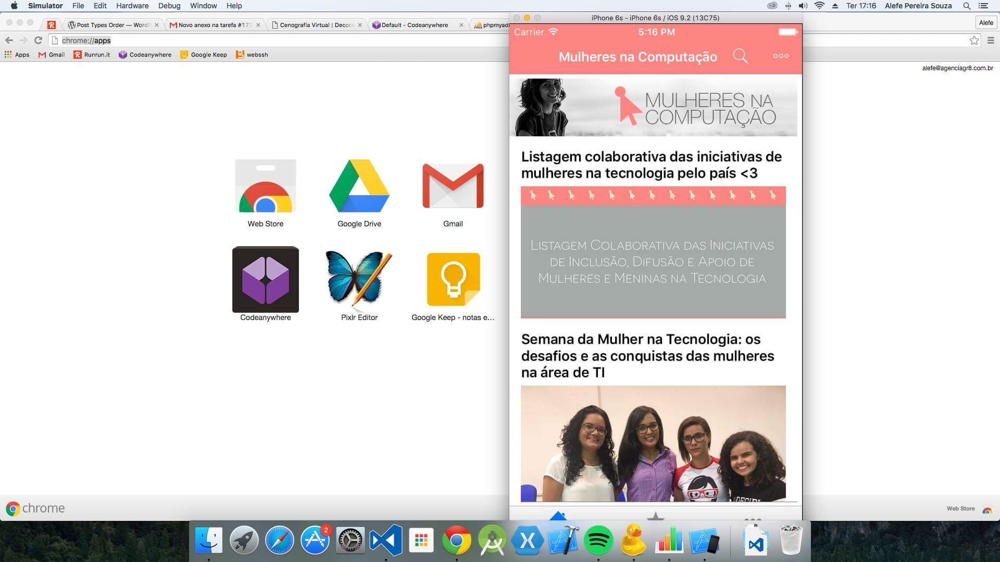
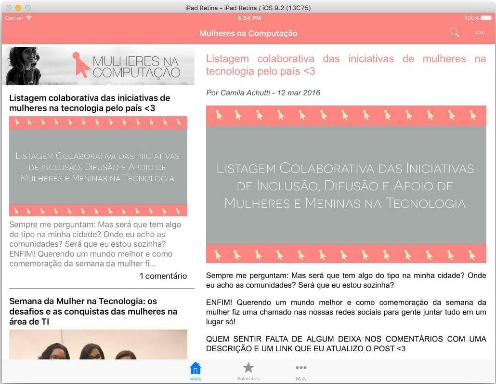

## Xamarin

These are screenshots of an iOS version of BlogApp that I didn't even remember I did, it was not released and the screenshots where made on the iMac from the company I worked at the time, as I didn't have a Mac at the time.

I didn't find the code for this app, probably I missed it at the mentioned iMac when I left the company.

| Image 1 | Image 2 | Image 3 |
|-|-|-|
|  |  |  |
|  |  |  |
|  |  |  |
|  | | |

