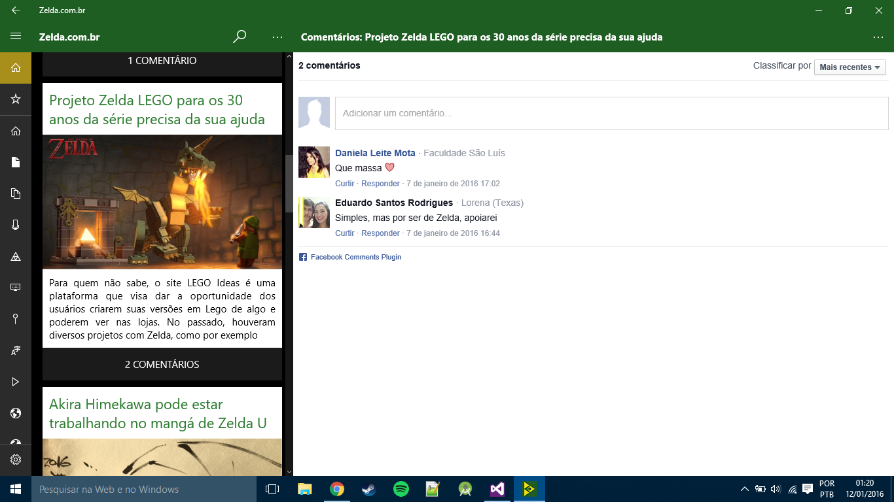
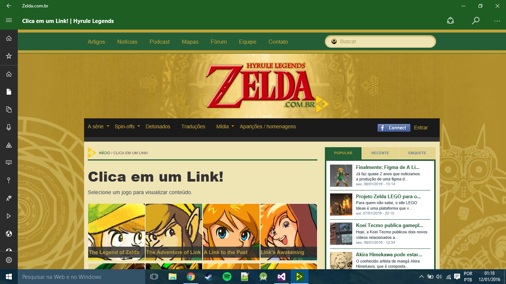
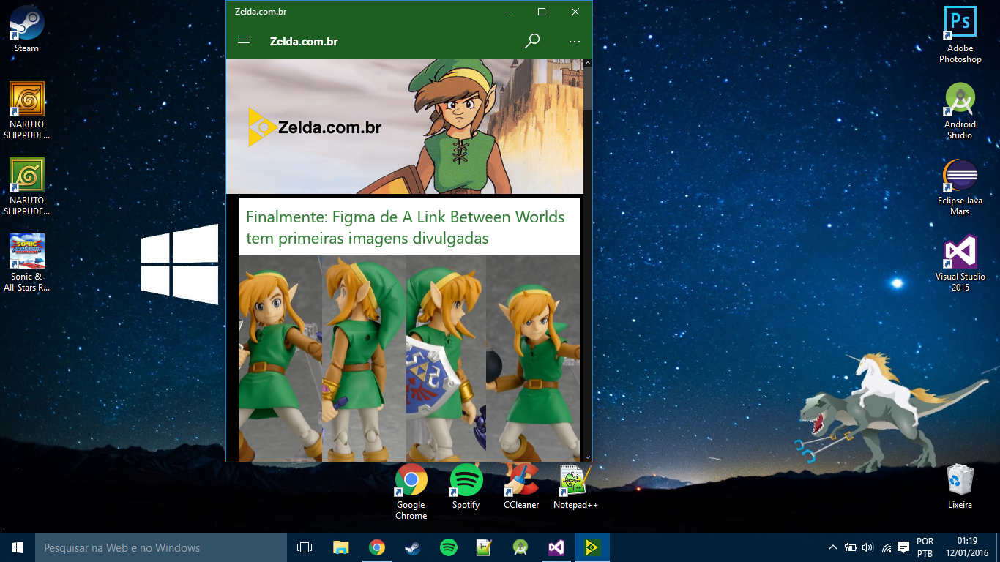
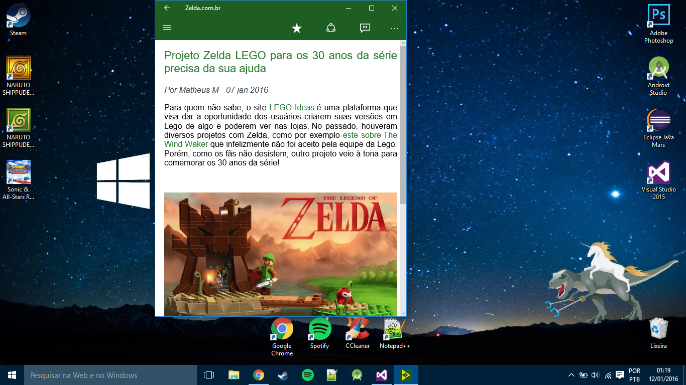

## ZeldaComBr

Zelda.com.br is a gaming news website, the UWP app uses their RSS feed and load the post content in a WebView, it also supports Windows push notifications and live tiles.

## Screenshots

The screenshots are from the Windows Store listing in 2015.

### Windows

Written in C#.

| Desktop |
|-|
|  |
|  |
|  |
|  |
|  |
|  |
|  |
|  |
|  |
